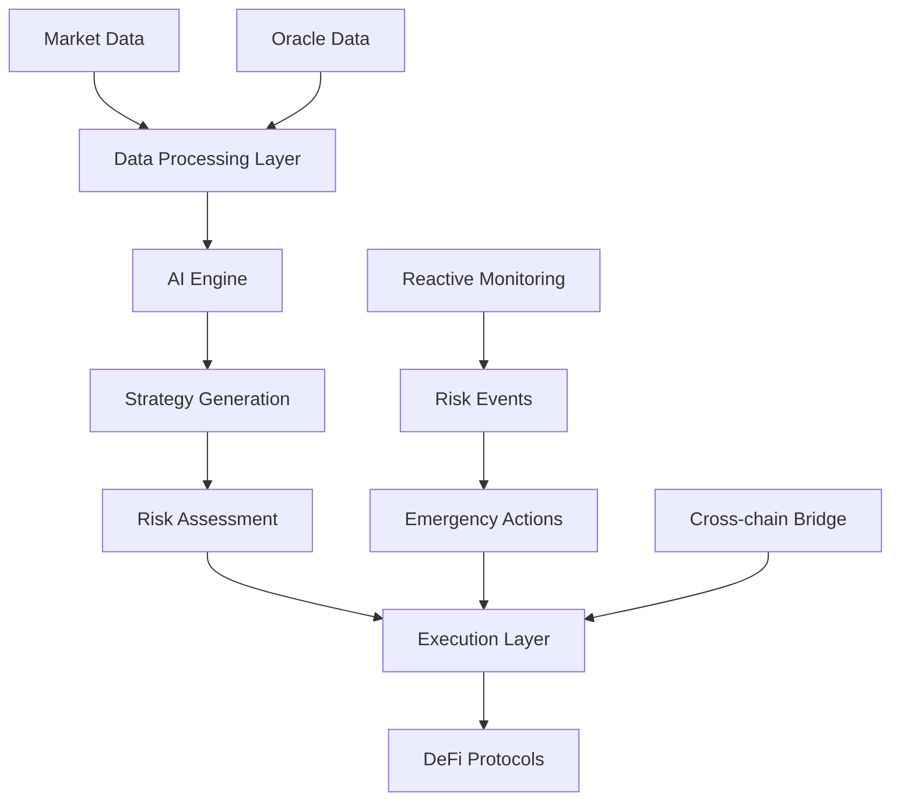

# Architecture Overview

## System Design

Shogun's architecture is built on three core principles: **modularity**, **scalability**, and **reliability**. The system is designed to handle high-frequency trading operations while maintaining strict risk management protocols.

## Core Components

### Data Processing Layer
- **Market Data Ingestion**: Real-time price feeds, volume data, and liquidity metrics
- **Event Processing**: On-chain event monitoring and analysis
- **Data Normalization**: Standardized data formats across different sources

### AI Engine
- **Signal Generation**: ML models for market prediction and opportunity identification
- **Strategy Optimization**: Dynamic parameter adjustment based on market conditions
- **Performance Analytics**: Continuous model performance monitoring and improvement

### Execution Layer
- **Trade Execution**: Automated order placement and management
- **Risk Management**: Real-time position monitoring and risk assessment
- **Cross-chain Operations**: Coordinated execution across multiple blockchain networks

## Integration Points

### DeFi Protocol Integration
- **Uniswap V4**: Advanced hook-based liquidity management
- **Lending Protocols**: Automated yield farming and borrowing strategies
- **Derivatives**: Options and futures trading automation

### Risk Management Systems
- **Reactive Hooks**: Emergency exit mechanisms for sudden market changes
- **Position Limits**: Automated enforcement of risk parameters
- **Correlation Monitoring**: Cross-asset risk assessment

### Data Sources
- **On-chain Oracles**: Chainlink, Pyth, and custom oracle networks
- **Market Data**: CEX feeds, DEX analytics, and social sentiment
- **Economic Indicators**: Macro data integration for strategy adjustment