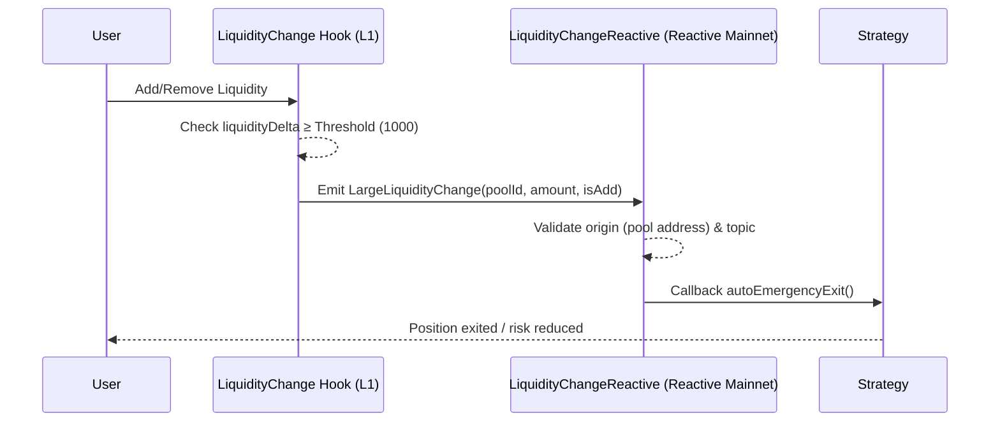

# Sequence Flow

This page describes the detailed sequence flow of the Reactive Hook System, illustrating how liquidity events on Ethereum mainnet trigger automated responses through the Reactive Network.

## System Flow Diagram

The following sequence diagram shows the complete flow from a user liquidity operation to the execution of automated strategies:



## Detailed Flow Description

### Step 1: User Liquidity Operation
**Actor**: User  
**Action**: Add/Remove Liquidity  
**Target**: LiquidityChange Hook (L1)

Users interact with the Uniswap v4 pool through standard liquidity operations. The LiquidityChange Hook is automatically triggered as part of the pool's hook framework when:
- Adding liquidity to a position
- Removing liquidity from a position
- Modifying existing position parameters

### Step 2: Threshold Validation
**Actor**: LiquidityChange Hook  
**Action**: Check liquidityDelta ≥ Threshold (1000)  
**Internal Process**

The hook performs internal validation to determine if the liquidity change is significant enough to warrant cross-chain notification:
- Compares the absolute value of liquidity delta against the configured threshold
- Current threshold is set to 1000 units
- Only changes meeting or exceeding this threshold proceed to event emission
- This filtering reduces unnecessary cross-chain events and associated costs

### Step 3: Cross-Chain Event Emission
**Actor**: LiquidityChange Hook  
**Action**: Emit LargeLiquidityChange(poolId, amount, isAdd)  
**Target**: Reactive Network (monitored by LiquidityChangeReactive)

When the threshold is met, the hook emits a structured event containing:
- `poolId`: Unique identifier for the affected pool
- `amount`: Magnitude of the liquidity change
- `isAdd`: Boolean indicating whether liquidity was added (true) or removed (false)

This event is broadcast on Ethereum mainnet and monitored by the Reactive Network.

### Step 4: Event Validation on Reactive Network
**Actor**: LiquidityChangeReactive  
**Action**: Validate origin (pool address) & topic  
**Internal Process**

The reactive contract performs critical security validations:
- **Origin Validation**: Confirms the event originated from the authorized hook contract address
- **Topic Validation**: Verifies the event topic hash matches the expected signature
- **Data Integrity**: Ensures the event data structure is valid and complete
- **Network Verification**: Confirms the event came from the correct source chain

Only events passing all validation checks proceed to strategy execution.

### Step 5: Strategy Callback Execution
**Actor**: LiquidityChangeReactive  
**Action**: Callback autoEmergencyExit()  
**Target**: Registered Strategy Contracts

Upon successful validation, the reactive contract triggers callbacks to all registered strategy contracts:
- Strategies receive the validated event data
- Each strategy can implement custom logic based on the liquidity change
- Common implementations include risk management, rebalancing, or emergency exits
- Multiple strategies can be triggered simultaneously

### Step 6: Automated Response
**Actor**: Strategy Contract  
**Action**: Position exited / risk reduced  
**Target**: User's positions/assets

Strategy contracts execute their programmed responses, which may include:
- **Emergency Position Exit**: Automatically closing positions to limit exposure
- **Risk Reduction**: Partially reducing position sizes
- **Rebalancing**: Adjusting portfolio allocations
- **Hedging**: Opening offsetting positions
- **Notification**: Alerting users or external systems

## Event Data Structure

### LargeLiquidityChange Event
```solidity
event LargeLiquidityChange(
    bytes32 indexed poolId,
    int256 amount,
    bool isAdd
);
```

**Parameters**:
- `poolId`: The unique identifier of the pool where liquidity changed
- `amount`: The magnitude of liquidity change (positive value)
- `isAdd`: True if liquidity was added, false if removed

## Timing Considerations

### Cross-Chain Latency
- Event emission on L1: Immediate (same transaction)
- Reactive Network detection: ~1-2 blocks (~12-24 seconds)
- Strategy execution: Near-immediate after detection
- Total end-to-end latency: ~30-60 seconds typical

### Gas Optimization
- Hook operations are optimized for minimal gas usage
- Event emission adds minimal overhead to liquidity operations
- Reactive Network execution doesn't consume L1 gas
- Strategy execution costs depend on implemented logic

## Error Handling

### Validation Failures
- Invalid origin addresses are rejected
- Malformed events are discarded
- Topic hash mismatches prevent execution
- Failed validations are logged for monitoring

### Strategy Execution Failures
- Individual strategy failures don't affect other strategies
- Failed executions can trigger fallback mechanisms
- Error events are emitted for debugging and monitoring
- Retry mechanisms can be implemented at the strategy level

## Security Considerations

### Origin Authentication
- Only events from authorized hook contracts are processed
- Contract addresses are verified against a whitelist
- Address spoofing is prevented through cryptographic verification

### Data Integrity
- Topic hashes ensure event structure authenticity
- Event parameters are validated for expected types and ranges
- Cross-chain data consistency is maintained through validation

### Access Control
- Strategy registration requires appropriate permissions
- Callback execution is restricted to validated events
- Administrative functions are protected by role-based access