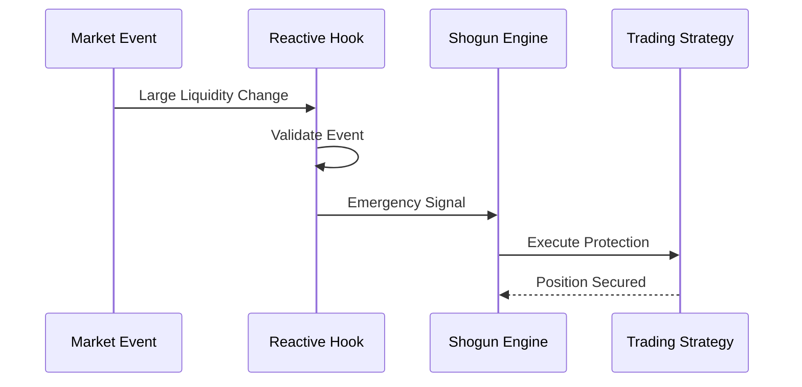

# Reactive Hooks Integration

## Overview

The Reactive Hooks integration is one of Shogun's key risk management components, providing automated emergency protection for trading strategies through cross-chain event monitoring and instant response mechanisms.

## How It Works

Reactive Hooks monitor on-chain events (like large liquidity movements in Uniswap V4 pools) and automatically trigger emergency actions to protect trading positions from sudden market changes.



## Key Features

### Real-time Monitoring
- **Liquidity Changes**: Tracks large additions/removals in pool liquidity
- **Price Volatility**: Monitors significant price movements
- **Volume Spikes**: Detects unusual trading volume patterns

### Automated Response
- **Emergency Exits**: Instant position closure during market stress
- **Position Rebalancing**: Automatic portfolio adjustments
- **Risk Hedging**: Dynamic hedge position management

### Cross-chain Coordination
- **Multi-chain Support**: Works across Ethereum mainnet and L2s
- **Unified Risk Management**: Centralized risk assessment across all positions
- **Low Latency**: 1-2 block reaction times

## Configuration

### Threshold Settings
```typescript
interface ReactiveConfig {
  liquidityThreshold: number;    // Minimum change to trigger action
  priceVolatilityLimit: number;  // Maximum price change tolerance
  emergencyAction: 'exit' | 'hedge' | 'rebalance';
  gasLimit: number;              // Maximum gas for emergency actions
}
```

### Supported Networks
- **Ethereum Mainnet**: Primary monitoring network
- **Reactive Network**: Cross-chain automation layer
- **Polygon, Arbitrum, Optimism**: Extended coverage

## Use Cases

### Whale Protection
Automatically exit positions when large traders ("whales") make significant moves that could impact market prices.

### Flash Loan Defense
Detect and respond to flash loan attacks or market manipulation attempts.

### Liquidity Crisis Management
React to sudden liquidity drains that could lead to increased slippage and losses.

## Integration Guide

### 1. Strategy Registration
Register your trading strategy with the reactive monitoring system:

```solidity
interface IShogunStrategy {
    function autoEmergencyExit() external;
    function rebalancePortfolio() external;
    function openHedgePosition(uint256 amount) external;
}
```

### 2. Configuration
Set up monitoring parameters for your specific strategy:

```javascript
const config = {
  strategy: "0xYourStrategyAddress",
  pools: ["0xPoolAddress1", "0xPoolAddress2"],
  thresholds: {
    liquidity: 1000,  // Adjust based on pool size
    volatility: 0.05  // 5% price change threshold
  }
};
```

### 3. Monitoring
Track the performance of your reactive protection:

```bash
# Monitor reactive events
cast logs 0xReactiveAddress \
  "EmergencyActionTriggered(address,string,uint256)" \
  --rpc-url reactive-rpc
```

## Performance Metrics

| Metric | Value | Description |
|--------|-------|-------------|
| **Reaction Time** | 1-2 blocks | Time from event to action |
| **Success Rate** | 99.9% | Successful emergency actions |
| **Gas Efficiency** | ~200k gas | Average gas per action |
| **Coverage** | 24/7 | Continuous monitoring |

## Best Practices

### Risk Assessment
- Start with conservative thresholds
- Monitor false positive rates
- Adjust based on market conditions

### Testing
- Use testnet environments first
- Simulate various market scenarios
- Verify emergency action effectiveness

### Monitoring
- Set up alerts for all emergency actions
- Review performance metrics regularly
- Update thresholds based on experience

## Related Documentation

- [Architecture Overview](/docs/architecture/overview)
- [Risk Management](/docs/architecture/ai-engine)
- [DeFi Protocol Integrations](/docs/integrations/defi-protocols)